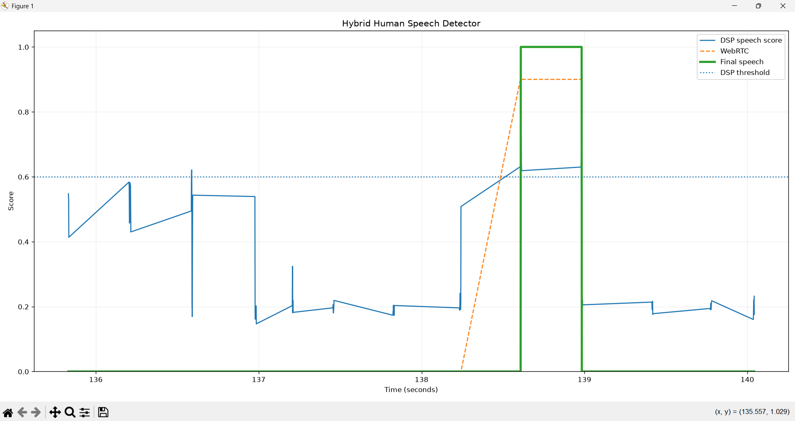
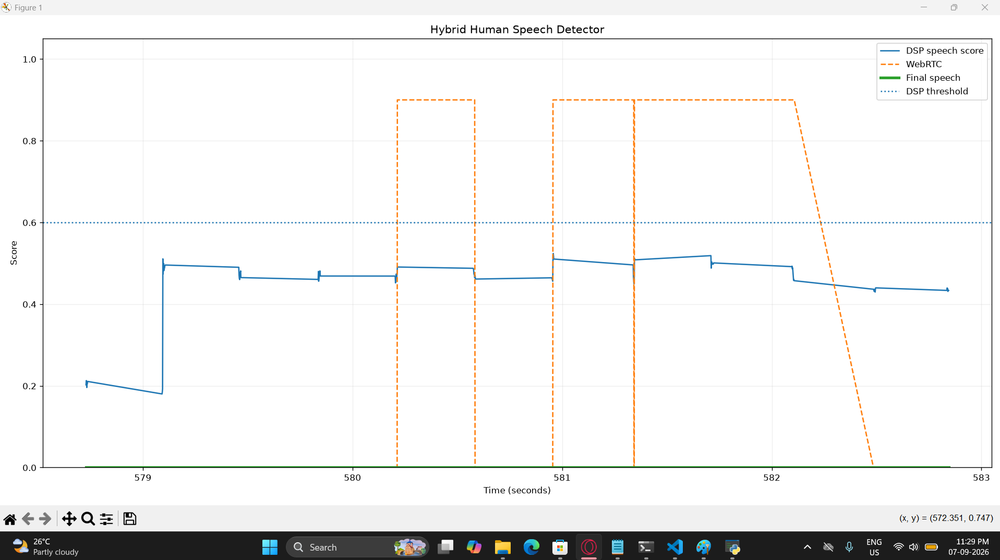

# ESP32 Low-Power Audio Prototype: Experimental Results

> **Headline Result:** The prototype achieved **7.33% total measured CPU utilization**, with approximately **6% attributed to telemetry and monitoring overhead**, resulting in roughly **1.34% CPU usage for the core application**. Heap usage was approximately **81.0 KB** against a 256 KB project budget. The system also maintained a **1.5-second audio pre-roll buffer** and successfully performed **wake-triggered Wi-Fi operation**.

---

## 1. Prototype Target vs. Measured Performance

| Parameter                 | Measured Result           | Target Constraint | Status   |
| :------------------------ | :------------------------ | :---------------- | :------- |
| **Tested Device**         | ESP32-C3                  | Target: ESP32-S3  | **PASS** |
| **CPU Utilization**       | 7.33% *(~1.34% core app)* | < 10.0%           | **PASS** |
| **Heap Used**             | 81.01 KB                  | < 256.0 KB        | **PASS** |
| **Heap Used vs. Budget**  | 31.65%                    | < 100%            | **PASS** |
| **Audio Pre-Roll Buffer** | 46.88 KB                  | 1.5 seconds       | **PASS** |

---

## 2. Speech Detection & Noise Filtering Test

*Initial validation was performed using a WebRTC VAD + 512-point FFT + Mel Spectrogram pipeline.*

## 3. Hybrid Speech Detection

*The second stage uses a hybrid approach combining WebRTC VAD, ZCR-based vowel characteristics, DSP audio signatures, transient rejection, and temporal verification.*

**Figure 3. Hybrid speech detection — human speech detected.**

**Figure 4. Hybrid speech detection — environmental noise rejected.**

---

## 4. System Telemetry Breakdown

### Tested Device: ESP32-C3 Hardware Context

* **Architecture:** Single-core 32-bit RISC-V microcontroller
* **Clock Speed:** 160 MHz
* **Internal RAM:** 400 KB of SRAM
* **Target Production Device:** Dual-core ESP32-S3

*Note: The ESP32-C3 was used for this prototype because it was the available hardware. The final production implementation is intended for the ESP32-S3.*

### CPU Utilization — 160 MHz, Single-Core FreeRTOS

* **Acquisition CPU:** 1.180%
* **VAD/DSP CPU:** 0.157%
* **Wi-Fi/Ping CPU:** 0.001%
* **Monitor CPU (Telemetry Overhead):** 5.989%
* **Total Measured CPU:** 7.326%
* **Core Application CPU:** **~1.338%**

*The monitor CPU represents the overhead introduced by serial logging and telemetry during testing. It is not part of the actual audio-processing or AI application workload.*

### Internal RAM & Heap

* **Total Internal Heap:** 319.91 KB *(ESP32-C3 specific)*
* **Used Heap:** 81.01 KB
* **Minimum Free Heap:** 204.91 KB
* **Largest Free Block:** 107.99 KB

### Network & Stability

* **Continuous Processing:** 3,584 consecutive frames processed with zero drops
* **Wi-Fi RTT:** 53–209 ms observed
* **Wi-Fi RSSI:** −47 dBm observed

---

## 5. Core Architectural Behaviors Validated

1. **Persistent Audio Buffering:** Successfully maintained a **46.88 KB, 1.5-second ring buffer** for 16 kHz, 16-bit mono audio without observed memory leaks during extended runs.

2. **Event-Driven Networking:** The Wi-Fi radio was activated only after a wake event, successfully performed the TCP connection/RTT test, and then disconnected to return the system toward a low-power state.

3. **Stack Headroom:** Stack usage remained within safe limits during the highest observed load, with more than **1,500 words free** on the Acquisition task and more than **1,050 words free** on the DSP task. No task starvation or stack overflow was observed.

---

## 6. Current Limitations & Next Steps

These results validate the baseline resource-gated architecture on the ESP32-C3. The following components still need to be integrated and benchmarked on the final production hardware:

* **Hardware Integration:** Move from the single-core ESP32-C3 prototype to the target dual-core ESP32-S3 and replace the synthetic audio input with a physical I2S MEMS microphone.

* **AI/ML Deployment:** Integrate the quantized INT8 KWS neural-network model and measure **False Activations per Hour (FAH)** and **False Rejection Rate (FRR)**.

* **Audio Encoding:** Implement the Opus encoder and benchmark its memory usage and CPU overhead.

* **Power & Latency Profiling:** Measure exact energy per inference/event *(mJ)* and end-to-end cloud ASR latency.
